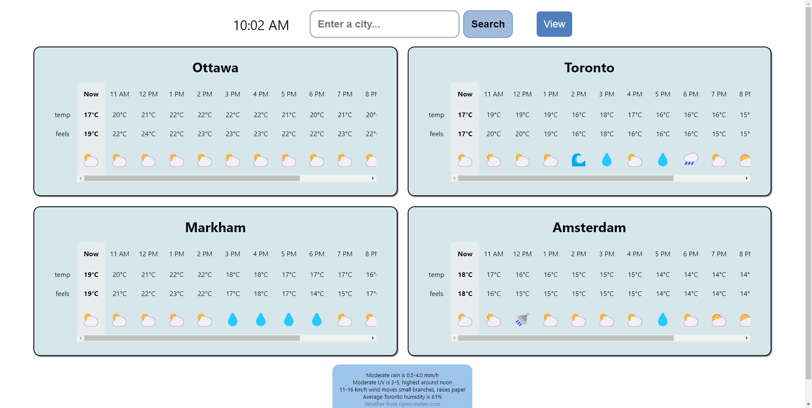
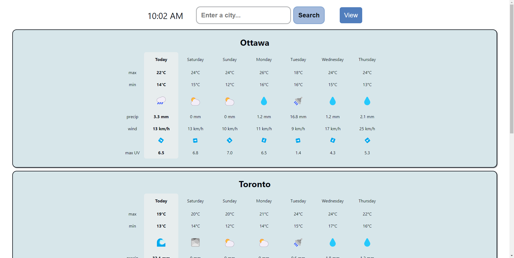
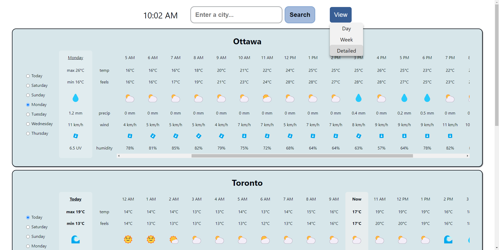

## Why weather?

The weather is important for when I go outside so I know what to wear and if I can play frisbee

## The app features...

- 3 different display modes
- Search for weather by city
- Digital clock
- Comfortable weather-viewing experience
- Media queries for thinner screens

## How it works

1. App component contains components
2. Card components receive location from Search component (there are default cities set), which uses a geocoding API to convert city name to latitude and longitude
3. Card components get weather data from GetWeather function which accesses a weather API, with varying parameters based on location and display mode
4. Weather information is shown!

## What I did

- Fetched and displayed responsive weather information from APIs with React
- Implemented state control and relevant hooks for seamless data flow between components
- Designed a user-friendly interface using HTML and CSS that adapts to varying screen sizes

## Gallery

